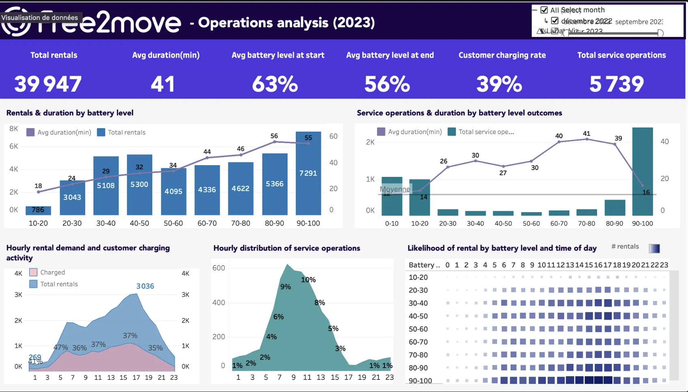

# ⚡ Free2move – Operations Analytics  
**Optimizing EV Charging Interventions**

---

## 📌 Overview
This project explores how battery charging sessions and rental demand interact in electric vehicle operations.  
The objective is to better understand **when sending a field agent to manage charging operations still creates value**, and when vehicles are likely to be rented before reaching full charge.

The analysis focuses on identifying **battery level thresholds and time patterns** where operational interventions may become unnecessary, helping reduce avoidable costs while maintaining vehicle availability.

## 📊 Dashboard Preview

Tableau : https://public.tableau.com/app/profile/alexandra.merli/viz/Classeur2_17665439841440/Tableaudebord1
---

## 🧠 Business Context
While vehicles are charging, there is a chance they may be rented before the battery reaches 100%.  
In such cases, sending a field agent to move or manage the vehicle may not be cost-effective.

The key business question addressed is:
> **At what battery level does the probability of a vehicle being rented become high enough that further charging interventions no longer make sense?**

---

## 🔍 Approach
The analysis follows a pragmatic, decision-oriented approach:

1. **Data exploration**
   - Charging sessions, battery levels at start and end
   - Rental events occurring during charging
   - Time-based patterns (hour of day)

2. **Battery level segmentation**
   - Battery levels grouped into 10% buckets to ensure interpretability
   - Focus on battery level at the **end of charging sessions**, as it is consistently available

3. **Behavioral analysis**
   - Rental likelihood during charging by battery level
   - Charging patterns by time of day
   - Agent service operations observed at different battery outcomes

4. **Visualization & insights**
   - Interactive Tableau dashboard to explore patterns and support operational decisions

---

## ⚠️ Key Assumptions & Limitations
- Some battery level start values related to agent operations are missing and could not be reliably reconstructed.
- Battery level at the **end of the session** is used as the most consistent indicator.
- The analysis prioritizes **decision-making insights** over perfect data completeness.

All assumptions are made explicit to avoid over-interpreting the data.

---

## 📦 Deliverables
- **Interactive dashboard** (Tableau)
- **Exploratory analysis** and transformations in Python
- **SQL queries** used for data preparation (BigQuery)
- Clear documentation of assumptions and methodology

---

## 🛠️ Tech Stack
- **SQL** (Google BigQuery)
- **Python** (data exploration & transformations)
- **Tableau** (visualization & dashboarding)

---

## 🎯 Outcome
This analysis highlights battery level ranges and time periods where charging interventions are less likely to be useful, providing a foundation for:
- optimizing agent dispatch decisions
- reducing unnecessary operational costs
- aligning charging strategies with actual rental demand

The project demonstrates an end-to-end analytics workflow, from raw data exploration to actionable operational insights.

